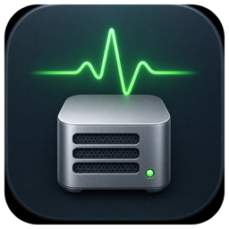
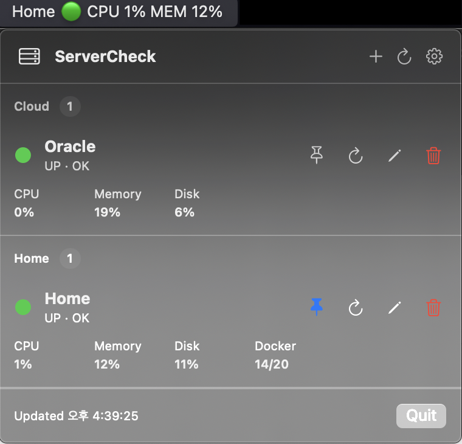
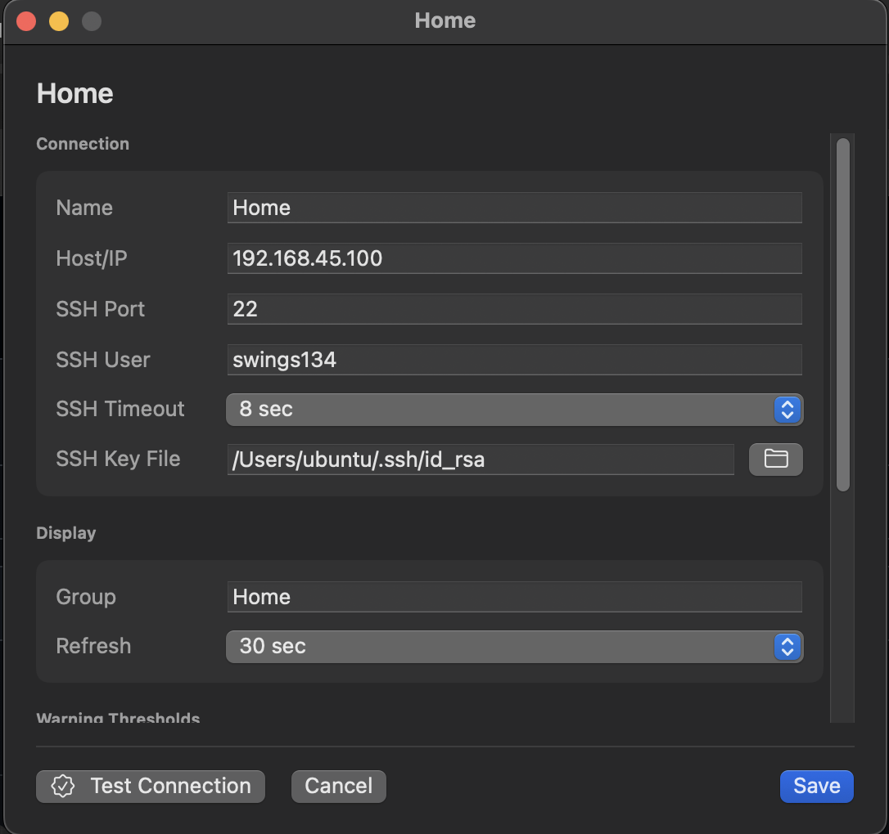
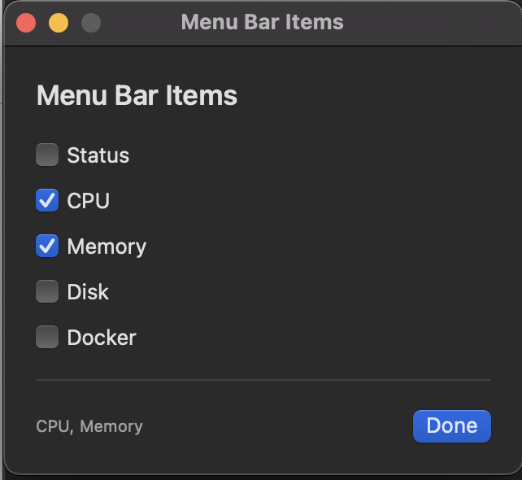

# ServerCheck

---
<a href="./images/icon_256x256.png"><p align="center"></p></a>





ServerCheck is a lightweight macOS menu bar app for checking Linux server health over SSH.

It is made for personal servers, home servers, small cloud instances, and Docker hosts where a full monitoring stack would be too much. ServerCheck does not require a server-side agent. It connects over SSH, runs predefined read-only commands, and shows the result in the macOS menu bar.

--- 

## Features

- macOS menu bar status display
- Multiple server management
- SSH key-based connection
- CPU, memory, and root disk usage checks
- Optional Docker container count checks
- Server groups
- Per-server refresh interval
- Per-server SSH timeout
- Warning thresholds for CPU, memory, and disk
- Representative server selection for the menu bar
- Optional all-server menu bar display
- Customizable menu bar items
- macOS notifications for server down/recovery events
- Incident log file
- Open at Login support

---

## Installation

1. Download the latest `ServerCheck.dmg` from GitHub Releases.
2. Open the DMG file.
3. Move `ServerCheck.app` to `Applications`.
4. Launch ServerCheck.

If macOS blocks the app because it was downloaded from the internet, open it with:

```text
Right click ServerCheck.app > Open
```

```text
If macOS blocks ServerCheck from opening, go to:

System Settings > Privacy & Security

Then scroll down and find the message saying that `ServerCheck` was blocked. Click `Open Anyway`, then confirm by clicking `Open`.

This warning appears because ServerCheck is not notarized by Apple yet.
```

---

## First Run

After launching ServerCheck, click the menu bar icon and add a server.

Required server fields:

- Name
- Host or IP
- SSH port
- SSH user
- SSH key file path

ServerCheck stores only the SSH key file path. It does not store SSH passwords or SSH key contents.

---

## Menu Bar Display

ServerCheck can show one selected server in the menu bar:

```text
Home 🟢 UP
```

Or it can show all servers:

```text
Home 🟢 UP  Oracle 🔴 DOWN  NAS 🟠 WARNING
```

Open Settings to choose the menu bar server, enable all-server display, or customize which items appear.

---

## Status

ServerCheck uses these states:

- `UP`: SSH connection and metric collection succeeded
- `WARNING`: CPU, memory, or disk reached the configured threshold
- `DOWN`: SSH connection, command execution, or parsing failed
- `CONNECTING`: Initial connection state

---

## Logs and Config

Incident log:

```text
~/Library/Application Support/ServerCheck/incidents.log
```

Config file:

```text
~/Library/Application Support/ServerCheck/servers.json
```

You can open the incident log from Settings.

---

## Updates

ServerCheck checks for updates only when you click `Check For Updates` in Settings.

When a new GitHub Release is available, the app shows:

- Current version
- Latest version
- Release notes
- Download button

The downloaded DMG is saved to:

```text
~/Downloads/ServerCheck.dmg
```

After downloading, install the new version manually by replacing the existing app in `Applications`.

---

## Supported languages
It Will Be Updated Soon With More Languages, For Now It Only Supports: English (en)

- English (en)

---
## License
ServerCheck Is It is not currently open source, <br/> 
but there are plans to convert it to open source in the future. <br/>
Currently, the rights belong to `swings134man`

---

# ServerCheck 한국어

---

ServerCheck는 SSH를 통해 Linux 서버 상태를 확인하는 경량 macOS 메뉴바 앱입니다.

개인 서버, 홈 서버, 소규모 클라우드 인스턴스, Docker 호스트처럼 전체 모니터링 스택을 구성하기에는 부담스러운 환경을 위해 만들어졌습니다. ServerCheck는 서버 측 에이전트가 필요하지 않습니다. SSH로 접속해 미리 정의된 읽기 전용 명령을 실행하고, 결과를 macOS 메뉴바에 표시합니다.

---

## 기능

- macOS 메뉴바 상태 표시
- 여러 서버 관리
- SSH 키 기반 연결
- CPU, 메모리, 루트 디스크 사용률 확인
- 선택적 Docker 컨테이너 개수 확인
- 서버 그룹별 관리
- 서버별 갱신 주기
- 서버별 SSH timeout
- CPU, 메모리, 디스크 경고 기준 설정
- 메뉴바에 표시할 대표 서버 선택
- 모든 서버 메뉴바 표시 옵션
- 메뉴바 표시 항목 사용자 지정
- 서버 DOWN/복구 이벤트 macOS 알림
- 장애 이력 로그 파일
- 로그인 시 시작 지원

---

## 설치

1. GitHub Releases에서 최신 `ServerCheck.dmg`를 다운로드합니다.
2. DMG 파일을 엽니다.
3. `ServerCheck.app`을 `Applications`로 이동합니다.
4. ServerCheck를 실행합니다.

인터넷에서 다운로드한 앱이라는 이유로 macOS가 실행을 차단하면 다음 방식으로 실행합니다.

```text
ServerCheck.app 우클릭 > 열기
```

```text
MacOs 시스템 설정 > 개인정보 및 보안

스크롤을 내려 `ServerCheck`가 차단되었다는 메시지를 찾은 다음 `그래도 열기`를 클릭하고, 다시 `열기`를 클릭해 확인합니다.
```

---

## 최초 실행

ServerCheck를 실행한 뒤 메뉴바 아이콘을 클릭하고 서버를 추가합니다.

필수 서버 항목:

- 이름
- Host 또는 IP
- SSH port
- SSH user
- SSH key 파일 경로

ServerCheck는 SSH key 파일 경로만 저장합니다. SSH 비밀번호나 SSH key 내용은 저장하지 않습니다.

---

## 메뉴바 표시

ServerCheck는 선택한 서버 하나를 메뉴바에 표시할 수 있습니다.

```text
Home 🟢 UP
```

또는 모든 서버를 함께 표시할 수 있습니다.

```text
Home 🟢 UP  Oracle 🔴 DOWN  NAS 🟠 WARNING
```

Settings에서 메뉴바에 표시할 서버를 선택하거나, 모든 서버 표시를 켜거나, 표시 항목을 사용자 지정할 수 있습니다.

---

## 상태

ServerCheck는 다음 상태를 사용합니다.

- `UP`: SSH 연결과 metric 수집 성공
- `WARNING`: CPU, 메모리, 디스크 중 하나가 설정한 경고 기준에 도달
- `DOWN`: SSH 연결, 명령 실행, 파싱 중 하나가 실패
- `CONNECTING`: 최초 연결 상태

---

## 로그와 설정

장애 이력 로그:

```text
~/Library/Application Support/ServerCheck/incidents.log
```

설정 파일:

```text
~/Library/Application Support/ServerCheck/servers.json
```

Settings에서 장애 이력 로그 파일을 열 수 있습니다.

---

## 업데이트

ServerCheck는 Settings의 `Check For Updates`를 클릭했을 때만 업데이트를 확인합니다.

새 GitHub Release가 있으면 앱에서 다음 정보를 표시합니다.

- 현재 버전
- 최신 버전
- Release notes
- 다운로드 버튼

다운로드된 DMG는 다음 위치에 저장됩니다.

```text
~/Downloads/ServerCheck.dmg
```

다운로드 후 기존 `Applications`의 앱을 새 버전으로 직접 교체해 설치합니다.

---

## 지원 언어

더 많은 언어는 추후 업데이트될 예정이며, 현재는 영어만 지원합니다.

- English (en)

---

## 라이선스

ServerCheck는 현재 오픈소스가 아닙니다. <br/>
추후 오픈소스로 전환할 계획이 있습니다. <br/>
현재 권리는 `swings134man`에게 있습니다.
